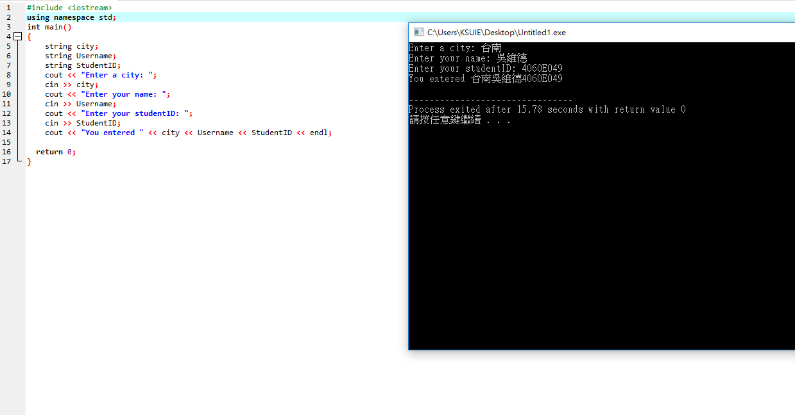

### 從螢幕讀取字串
```
int main()
{
	string city;
	string Username;
	string StudentID;
	cout << "Enter a city: ";
	cin >> city; 
	cout << "Enter your name: ";
	cin >> Username; 
	cout << "Enter your studentID: ";
	cin >> StudentID; 
	cout << "You entered " << city << Username << StudentID << endl;
  
  return 0;
}
```




