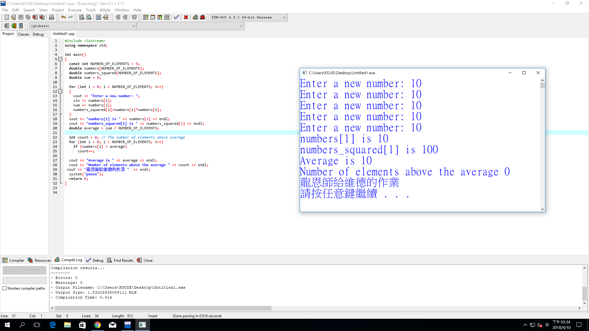

###### exercise1:陣列存取與基本運算(2018.4.17)
```

```
#include <iostream>
#include <iomanip>
using namespace std;
int main()
{
    int i,j,k;
    int a[3][3],b[3][3],c[3][3];
    for (i=0;i<=2;i++){
		for (j=0;j<=2;j++){
			a[i][j]=i+j;
			cout<<setw(7)<<a[i][j]; 
		}
		cout<<endl;
	}


```


```

