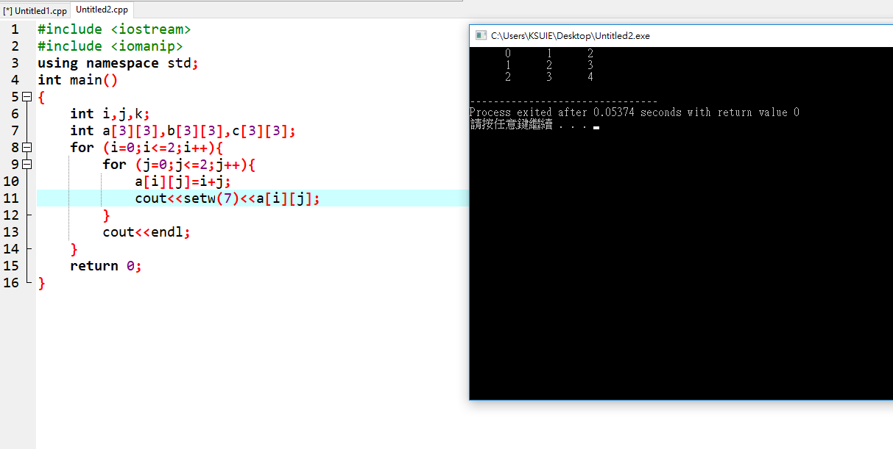
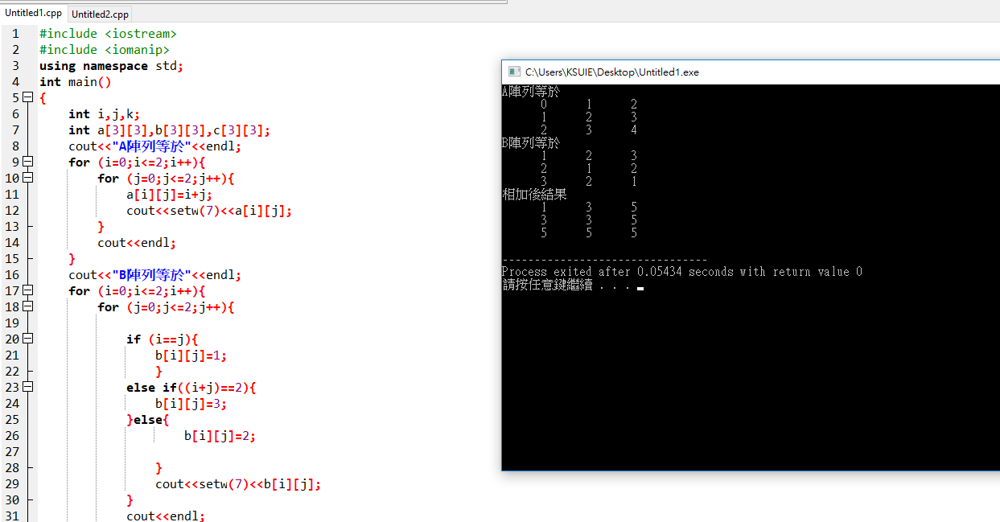

###### exercise1:3x3陣列存取(2018.4.17)

```
#include <iostream>
#include <iomanip>
using namespace std;
int main()
{
    int i,j,k;
    int a[3][3],b[3][3],c[3][3];
    for (i=0;i<=2;i++){
		for (j=0;j<=2;j++){
			a[i][j]=i+j;
			cout<<setw(7)<<a[i][j]; 
		}
		cout<<endl;
	}


```



###### exercise1:3x3陣列相加(2018.4.17)

```
#include <iostream>
#include <iomanip>
using namespace std;
int main()
{
    int i,j,k;
    int a[3][3],b[3][3],c[3][3];
    cout<<"A陣列等於"<<endl; 
    for (i=0;i<=2;i++){
		for (j=0;j<=2;j++){
			a[i][j]=i+j;
			cout<<setw(7)<<a[i][j]; 
		}
		cout<<endl;
	}
	cout<<"B陣列等於"<<endl; 
	for (i=0;i<=2;i++){
		for (j=0;j<=2;j++){
			
			if (i==j){
				b[i][j]=1;
				}
			else if((i+j)==2){
				b[i][j]=3;
			}else{
					b[i][j]=2;
					
				}
				cout<<setw(7)<<b[i][j]; 
			}
			cout<<endl;
		}
	cout<<"相加後結果"<<endl;
	for (i=0;i<=2;i++){
		for (j=0;j<=2;j++){
			c[i][j]=a[i][j]+b[i][j];
			cout<<setw(7)<<c[i][j]; 
		}
		cout<<endl;
	}
		
	
	
    return 0;
}


```



